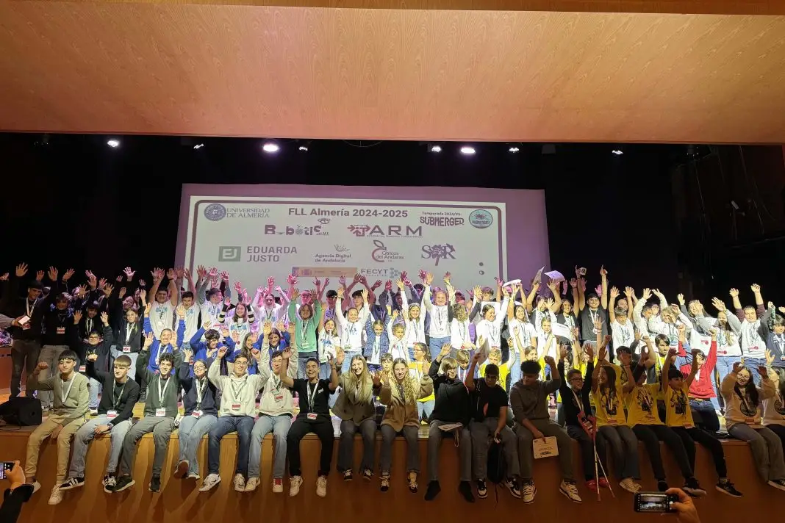
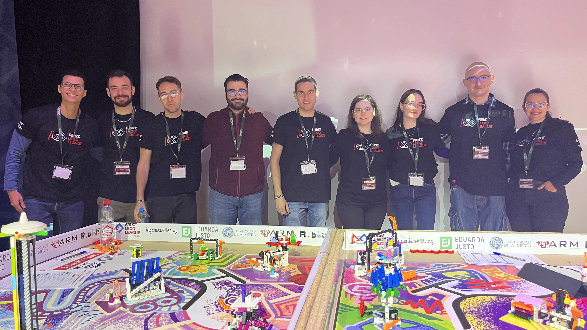
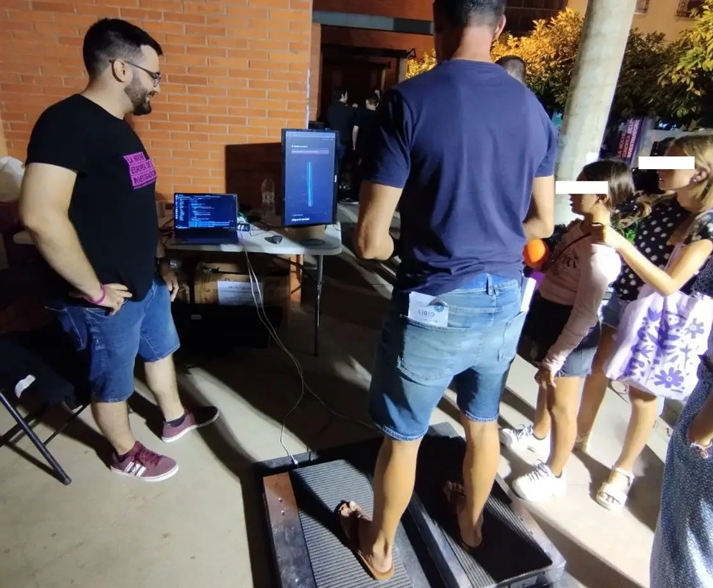
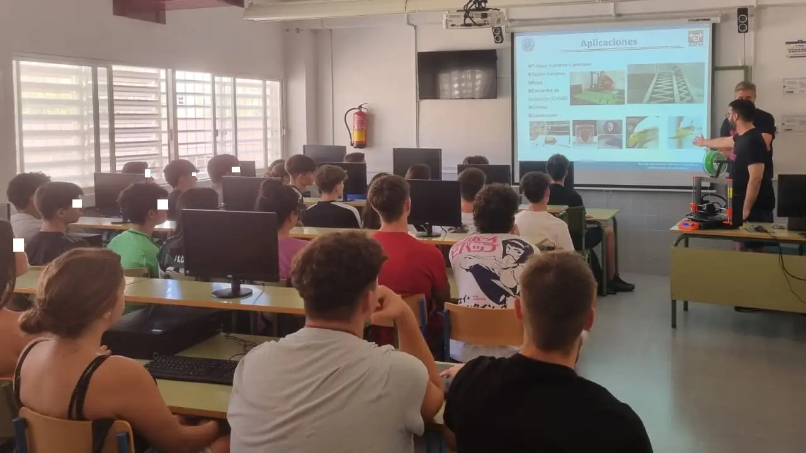
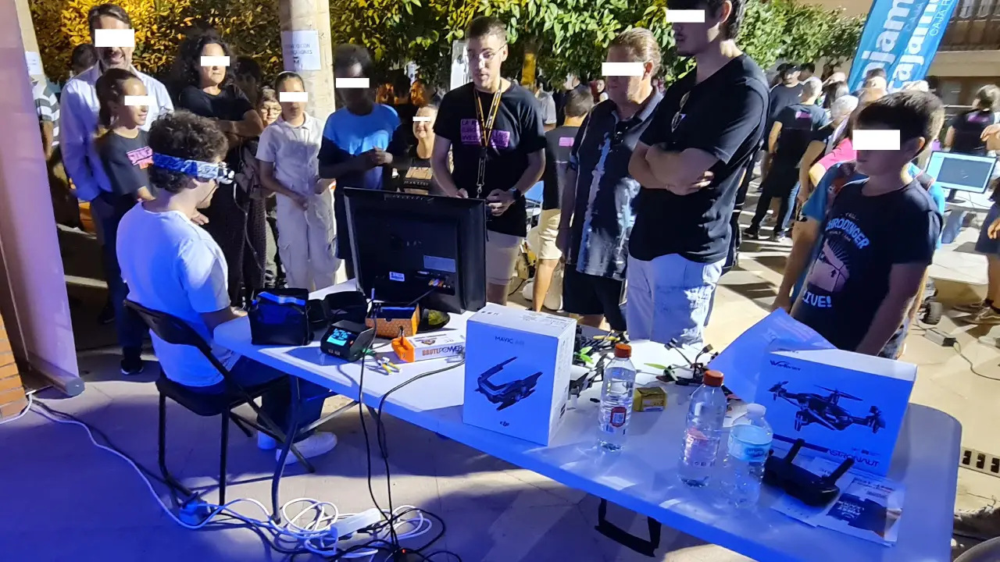

## First Lego League

*From 2018 to Present*

A provincial-level tournament where teams present innovative solutions to real-world challenges and build autonomous robots to complete a series of defined missions.

These missions are completed through programming, testing, and design, encouraging students to apply STEM skills in a hands-on, problem-solving environment.

The goal of the referees is to assess the robot's autonomous execution of the missions, following the established rules and criteria.

<figure markdown="span">
  { width="100%" }
  <figcaption>FLL Almería 2025 - SUBMERGED Challenge</figcaption>
</figure>

<figure markdown="span">
  { width="100%" }
  <figcaption>FLL Almería 2024 - Referee team</figcaption>
</figure>

[:fontawesome-solid-globe:{ .middle } UAL News FLL 2025](https://news.ual.es/ciencia/nuevo-exito-de-la-first-lego-league-2025-dedicada-a-solucionar-problemas-bajo-el-mar/){ .md-button .md-button--primary }

---

## European Researcher's Night

A European science outreach project promoted since 2005 by the European Commission.

Each year, a series of activities is held simultaneously in nearly 400 European cities, with the mission of bringing science and research closer to the general audience.

### 2024

<figure markdown="span">
  { width="100%" }
  <figcaption>NEI Almería 2024 - Force platorms equilibrium challenge</figcaption>
</figure>

<a href="https://github.com/AaronPB/nei-force-platform-ranking" target="_blank"></a>

### 2023

<figure markdown="span">
  { width="100%" }
  <figcaption>NEI Almería 2023 - 3D Printer course</figcaption>
</figure>

<figure markdown="span">
  { width="100%" }
  <figcaption>NEI Almería 2023 - Drone FPV nagivation</figcaption>
</figure>

