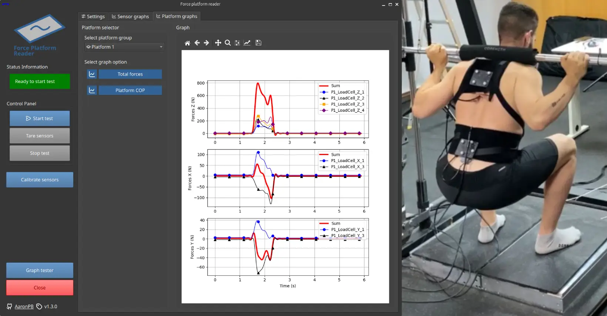

# Research

## Autobiography

In 2019 I completed my undergraduate studies in Mechanical Engineering and started my path in research, with several projects in different areas such as robotics, autonomous navigation, non-intrusive monitoring and biomechanics.
In 2022 I combined part of these projects with a Masters in Industrial Engineering, which I managed to finish in 2024.

Currently, I am pursuing my PhD entitled *"Control and optimisation techniques for efficient and sustainable integration of desalination technologies in CSP plants"* at the Solar Thermal Applications Unit of the Almería Solar Platform, part of the Research Centre for Energy, Environment and Technology (CIEMAT).

## Projects

### :fontawesome-solid-weight-scale: Software development and calibration of a force platform for sports science

Master's Thesis in Industrial Engineering - 2024

{ width=100% }

- Data acquisition software development in Python with data synchronization between multiple sensors.
- Calibration procedure of a new triaxial force platform.
- Practical applications of the developed software: squat exercises, biomechanical validations, vetical jump analysis and posture evaluation during bicep curls.

[:fontawesome-solid-globe:{ .middle } Institutional repository *(available soon)*](#){ .md-button .md-button--primary }

[:fontawesome-solid-globe:{ .middle } Project website](https://aaronpb.github.io/force_platform/){ .md-button .md-button--primary }

__Project public repositories in GitHub__

<a href="https://github.com/AaronPB/force_platform" target="_blank"></a>

<a href="https://github.com/AaronPB/force-platform-app" target="_blank"></a>
<a href="https://github.com/AaronPB/nei-force-platform-ranking" target="_blank"></a>

---

### :material-weight-lifter: Improvement of the sensor system in the strength training machine

Research Project *"Design, Manufacturing, and EMG-Biomechanical Assessment of a Constant Force Mechanism"* - 2023

{ width=100% }

- Sensor reading software developed in Python with QT.
- Programming in Matlab for processing the data recorded during measurements.
- Development of multibody models for bench press and squat exercises.

__Project public repositories in GitHub__

<a href="https://github.com/AaronPB/force_platform" target="_blank"></a>

---

### :material-meter-electric: Analysis and efficient management of electrical energy using IoT sensors and distributed cloud computing

Research Project *"Analysis and efficient management of electrical energy using IoT sensors and distributed cloud computing"* - 2022

{ width=100% }

- Real-time integration of electrical consumption into machine learning systems using smart meters and high-precision power quality analyzers.
- Development of a predictive model for electrical consumption disaggregation using particle filter algorithms.

[:material-file-document:{ .middle } Publication at ICHQP-2022](https://ieeexplore.ieee.org/abstract/document/9808618){ .md-button .md-button--primary }

---

### :simple-drone: Drone indoor autonomous navigation in greenhouses

Research Project *"Real-time integration of electrical consumption into machine learning systems using smart meters and high-precision power quality analyzers"* - 2021

Student Grant *"DroneCrop"* - 2019

{ width=100% }

- Development of a ROS environment for indoor drone navigation.
- Use of Ultra Wide Band (UWB) technology combined with particle filters and computer vision.
- SLAM optimization (ORB-SLAM3) using factor graphs with the GTSAM library.
- Development of the navigation control algorithm, including a route planning system using the MRPT library.

---

### :material-car-electric: Integration and characterization of the photovoltaic system in the UAL-eCARM vehicle

Bachelor's Degree Final Project - 2019

{ width=100% }

- Software development for reading data through ROS (Robot Operating System).
- Assembly of the electric system and components in the vehicle.
- Measurement and evaluation of data.

[:fontawesome-solid-globe:{ .middle } Institutional repository](http://repositorio.ual.es/handle/10835/8041){ .md-button .md-button--primary }

__Project public repositories in GitHub__

<a href="https://github.com/AaronPB/vemppt_reader" target="_blank"></a>
<a href="https://github.com/AaronPB/ros_mppt" target="_blank"></a>

---

### :material-solar-panel-large: Simulation and installation of a micro-grid with solar energy

Internship at the Solar Energy Research Centre (CIESOL) - 2019

{ width=100% }

- Design and material quotation of support platforms for solar panels, with SolidWorks.
- Assembly and installation of a micro-grid with solar energy.
- Data analysis using Matlab via modbus protocol, and configuration of the system in Energy Storage System (ESS) mode to store surplus electrical energy in batteries.

[:material-file-document:{ .middle } Publication at ISES-SWC-2019](https://www.researchgate.net/publication/342252285_Photovoltaic_Microgrid_Emulator_for_Educational_Purposes){ .md-button .md-button--primary }

<!---
<a href="https://github.com/AaronPB/macrohg" target="_blank" class="image fit"></a>

<a href="https://github.com/AaronPB/veteranias" target="_blank" class="image fit"></a>
--->
