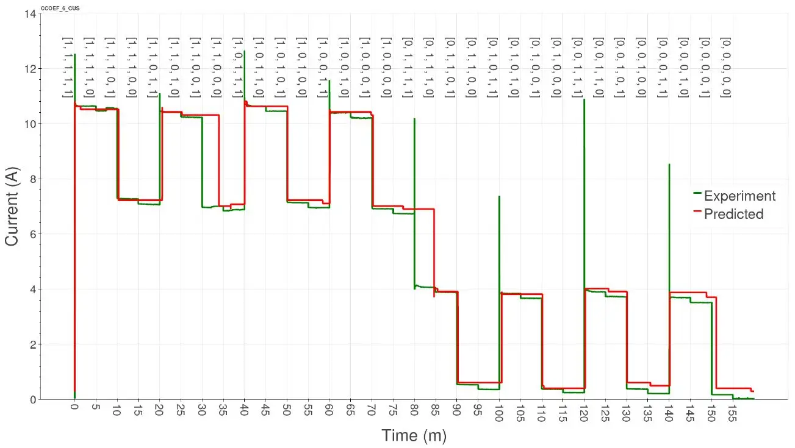
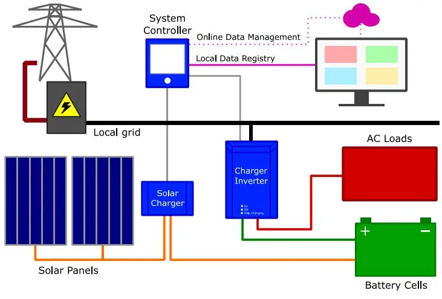

## 2025

!!! tip "Cooking! :)"

## 2019 - 2024

-   #### :material-file-document:{ .xl .middle } Load Disaggregation Through Particle Filtering of Harmonic Features

    :fontawesome-solid-location-dot: *2022 20th International Conference on Harmonics & Quality of Power (ICHQP)*

    ---

    { width="100%" }
    
    [:fontawesome-solid-globe:{ .middle } View article](https://ieeexplore.ieee.org/abstract/document/9808618){ .md-button .md-button--primary }

-   #### :material-file-document:{ .xl .middle } Photovoltaic Microgrid Emulator for Educational Purposes

    :fontawesome-solid-location-dot: *ISES Solar World Congress 2019*

    ---

    { width="100%" }
    
    [:fontawesome-solid-globe:{ .middle } View article](https://www.researchgate.net/publication/342252285_Photovoltaic_Microgrid_Emulator_for_Educational_Purposes){ .md-button .md-button--primary }

